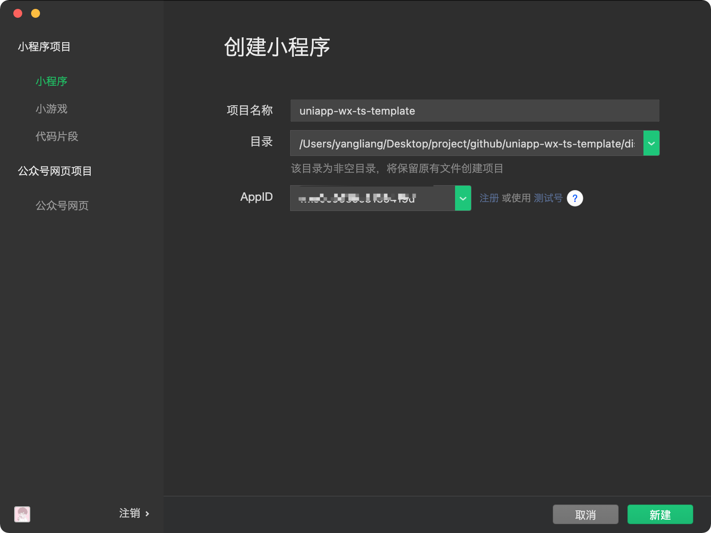
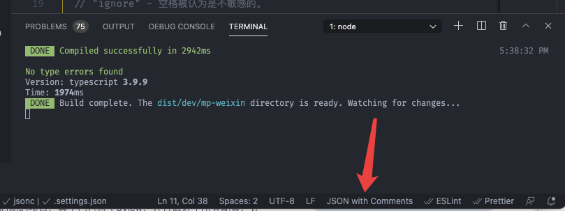

# 项目搭建笔记

## 软件安装

### 下载 HBuilderX

点击：<https://www.dcloud.io/hbuilderx.html> 下载正式版下的标准版。

### 下载 VSCode

前往：<https://code.visualstudio.com/> 下载。

## uni-app 安装

### 环境安装

全局安装 `vue-cli`

```shell
npm install -g @vue/cli
```

### 创建项目

```shell
vue create -p dcloudio/uni-preset-vue uniapp-wx-template
```

在提示中选择 `默认模板` 后回车。

创建完毕进入项目：

```shell
cd uniapp-wx-template
```

### 安装 sass

```shell
npm i sass-loader node-sass
```

编译报错：

```shell
Syntax Error: TypeError: this.getOptions is not a function
```

解决方案：<https://stackoverflow.com/questions/66082397/typeerror-this-getoptions-is-not-a-function>

安装 `sass-loader@10.1.1`

### 导入 uni-app 官方 uni-ui 库

文档：<https://ext.dcloud.net.cn/plugin?id=55>

```shell
npm install @dcloudio/uni-ui -d
```

使用 `npm` 安装好 `uni-ui` 之后，需要配置 `easycom` 规则，让 `npm` 安装的组件支持 `easycom`

打开项目根目录下的 `pages.json` 并添加 `easycom` 节点：

```json
// pages.json
{
  "easycom": {
    "autoscan": true,
    "custom": {
      // uni-ui 规则如下配置
      "^uni-(.*)": "@dcloudio/uni-ui/lib/uni-$1/uni-$1.vue"
    }
  },

  // 其他内容
  "pages": [
    // ...
  ]
}
```

使用组件：

`src/pages/index/index.vue` 中使用组件。

```html
<uni-badge text="1"></uni-badge>
<uni-badge text="2" type="success" @click="bindClick"></uni-badge>
<uni-badge text="3" type="primary" :inverted="true"></uni-badge>
```

### 本地预览

```bash
npm run dev:mp-weixin
```

此时项目根目录下会生成 `dist/dev/mp-weixin` 目录，打开你的小程序，选择创建小程序，目录选择 `dist/dev/mp-weixin` ，AppID 生成测试号，点击创建即可：



## VSCode 相关配置

### 项目工作区配置

在项目根目录下创建 `.vscode` 并创建两个必要 json 文件：

```shell
.vscode/
|- extensions.json
|- settings.json
```

#### extensions.json 文件

用于用户使用 VSCode 打开此项目时，弹出的推荐安装插件，（请告知用户在 VSCode 弹出推荐插件后点击允许）：

```json
{
  "recommendations": ["octref.vetur", "esbenp.prettier-vscode", "dbaeumer.vscode-eslint", "stylelint.vscode-stylelint"],
  "unwantedRecommendations": ["yoyo930021.vuter"]
}
```

#### settings.json 用户偏好设置

在项目根目录下创建 `.vscode/settings.json` 文件，详情配置见代码。

此刻 VSCODE 会报错：`Comments are not permitted in JSON`，这是由于 json 中不可添加注释，解决方案为在 VSCODE 的右下角的配置 JSON 更改为 `JSON with Comments` 即可：



### 插件安装

将 `.vscode/extensions.json` 下所有 `recommendations` 中的插件都安装上。

- ✅ 字体加粗为必须安装
- 👍 没有加粗为可选，但推荐安装

#### 风格检查、格式化

- **[ESLint](https://marketplace.visualstudio.com/items?itemName=dbaeumer.vscode-eslint) JS 代码审查工具**
- **[StyleLint](https://marketplace.visualstudio.com/items?itemName=stylelint.vscode-stylelint) CSS 代码审查工具**
- [MarkdownLint](https://marketplace.visualstudio.com/items?itemName=DavidAnson.vscode-markdownlint) Markdown 代码审查工具
- **[Prettier](https://marketplace.visualstudio.com/items?itemName=esbenp.prettier-vscode) 代码格式化工具**
- **[Vetur](https://marketplace.visualstudio.com/items?itemName=octref.vetur) Vue 开发工具**

#### 编码效率

##### 代码片段

- [HTML Snippets](https://marketplace.visualstudio.com/items?itemName=abusaidm.html-snippets) HTML 代码智能提示
- [Javascript (ES6) Code Snippets](https://marketplace.visualstudio.com/items?itemName=xabikos.JavaScriptSnippets) ES6 代码智能提示
- [Javascript Patterns Snippets](https://marketplace.visualstudio.com/items?itemName=nikhilkumar80.js-patterns-snippets) JavaScript 代码提示

##### 代码补全

- [Auto Close Tag](https://link.juejin.im/?target=https://marketplace.visualstudio.com/items?itemName=formulahendry.auto-close-tag)，在打开标签并且键入 `</` 的时候，能自动补全要闭合的标签；
- [Auto Rename Tag](https://link.juejin.im/?target=https://marketplace.visualstudio.com/items?itemName=formulahendry.auto-rename-tag)，在修改标签名时，能在你修改开始（结束）标签的时候修改对应的结束（开始）标签。
- [Path Intellisense](https://link.juejin.im/?target=https://marketplace.visualstudio.com/items?itemName=christian-kohler.path-intellisense)，文件路径补全，在你用任何方式引入文件系统中的路径时提供智能提示和自动完成。
- [NPM Intellisense](https://link.juejin.im/?target=https://marketplace.visualstudio.com/items?itemName=christian-kohler.npm-intellisense)，NPM 依赖补全，在你引入任何 node_modules 里面的依赖包时提供智能提示和自动完成。
- [Path Autocomplete](https://marketplace.visualstudio.com/items?itemName=ionutvmi.path-autocomplete)，为 VSCode 提供路径完成代码
- [IntelliSense for CSS class names in HTML](https://marketplace.visualstudio.com/items?itemName=Zignd.html-css-class-completion)，CSS 类名补全，会自动扫描整个项目里面的 CSS 类名并在你输入类名时做智能提示。
- [Emmet](https://link.juejin.im/?target=https://emmet.io)，VSCode 已经内置，官方介绍文档[参见](https://code.visualstudio.com/docs/editor/emmet)【不用安装】。
- [Auto Import](https://marketplace.visualstudio.com/items?itemName=steoates.autoimport)，自动查找、解析并提供所有可导入（import）的代码文件
- [Better Comments](https://marketplace.visualstudio.com/items?itemName=aaron-bond.better-comments) 代码注释高亮
- [Import Cost](https://marketplace.visualstudio.com/items?itemName=wix.vscode-import-cost) 显示导入的包的大小
- [Template String Converter](https://marketplace.visualstudio.com/items?itemName=meganrogge.template-string-converter) 字符串中添加变量时，自动转为模板字符串形式
- [Vue VSCode Snippets](https://marketplace.visualstudio.com/items?itemName=sdras.vue-vscode-snippets) Vue 代码补全
- [Vue helper](https://marketplace.visualstudio.com/items?itemName=shenjiaolong.vue-helper)，提高 vue 开发效率，在 vue 单文件可实现跳转方法定义

##### 代码运行

- [Code Runner](https://marketplace.visualstudio.com/items?itemName=formulahendry.code-runner) 代码一键运行

#### 功能增强

- [Settings Sync](https://marketplace.visualstudio.com/items?itemName=Shan.code-settings-sync)，基于 Gist 实现 VSCode 用户配置、快捷键配置、已安装插件列表等的备份和恢复功能，配置过程有详细精确的操作步骤文档。生成的备份 Gist 默认是私密的，如果你想设置为共享的，也可以一键切换。
- [Code Spell Checker](https://marketplace.visualstudio.com/items?itemName=streetsidesoftware.code-spell-checker) 代码拼写检查
- [Git History](https://marketplace.visualstudio.com/items?itemName=donjayamanne.githistory) 查看文件 Git 历史记录
- [Live Server](https://marketplace.visualstudio.com/items?itemName=ritwickdey.LiveServer) 开启本地服务器
- [Settings Sync](https://marketplace.visualstudio.com/items?itemName=Shan.code-settings-sync) 同步 vscode 配置
- [GitLens — Git supercharged](https://marketplace.visualstudio.com/items?itemName=eamodio.gitlens) Git 源代码管理工具

#### 外观增强

- [TODO Highlight](https://marketplace.visualstudio.com/items?itemName=wayou.vscode-todo-highlight)
  维护时间稍长的代码仓库免不了会有各种 TODO、FIXME、HACK 之类的标记，TODO Highlight 能够帮我们把这些关键词高亮出来，在你翻阅代码时非常醒目，就像是在大声提醒你尽快把他解决掉。支持自定义配置需要高亮的关键词，实际使用比较坑的地方是，TODO、FIXME 之类的后面必须加上冒号，否则无法高亮。
- [Color Highlight](https://link.juejin.im/?target=https://marketplace.visualstudio.com/items?itemName=naumovs.color-highlight)，识别代码中的颜色，包括各种颜色格式。
- [Bracket Pair Colorizer Bracket Pair Colorizer 2](https://marketplace.visualstudio.com/items?itemName=CoenraadS.bracket-pair-colorizer-2)，识别代码中的各种括号，并且标记上不同的颜色，方便你扫视到匹配的括号。

## ESLint + Prettier + StyleLint 配置

终端执行：

```shell
vue add eslint
? Pick an ESLint config: Prettier
? Pick additional lint features: Lint on save
```

选择 Prettier 方案。

执行完毕后会在项目根目录下生产 `.eslintrc.js` 文件。

### 配置 .eslintrc.js 文件

执行 `npm run dev:mp-weixin` 后，eslint 会根据 `.eslintrc.js` 中使用到的插件对项目文件进行检测并报出警告或错误。而我们会使用到 prettier 来格式化文件，为了避免 `Ctrl+S` 自动保存后冲突报错，我们还需要在 `rules` 中配置额外的规则（针对 extends 中的 @vue/prettier），详情见 `.eslintrc.js`

### 配置 .prettierrc.js 文件

在项目根目录下新建 `.prettierrc.js`，配置见文件。

### 配置 .stylelintrc.js 文件

> 安装依赖

```shell
npm install -D stylelint stylelint-config-standard stylelint-config-rational-order stylelint-prettier stylelint-config-prettier
```

[stylelint-config-standard：](https://github.com/stylelint/stylelint-config-standard) 官网提供的 css 标准

[stylelint-config-recess-order：](https://github.com/stormwarning/stylelint-config-recess-order) 属性排列顺序

[stylelint-prettier：](https://www.npmjs.com/package/stylelint-prettier) 基于 `prettier` 代码风格的 `stylelint` 规则

[stylelint-config-prettier：](https://www.npmjs.com/package/stylelint-config-prettier) 禁用所有与格式相关的 Stylelint 规则，解决 prettier 与 stylelint 规则冲突，确保将其放在 `extends` 队列最后，这样它将覆盖其他配置。

> 配置文件

在项目根目录下新建 `.stylelintrc.js` 文件，配置见文件。

## 配置 lint-staged + husky 限制提交

假设有一个同事头铁，就是不正确安装插件和配置编译器。他提交代码的风格就无法得到统一，所以需要再增加一层保险，在 git commit 时候需要校验所有改动过的文件，对这些文件使用 prettier --write 。

git commit 时触发、校验所有改动过的文件。这两个功能分别是两个插件：

- husky 运行 Githooks 诸如 Pre-commit、pre-receive 和 post-receive。用以在各个阶段触发不同校验，一般配合各种 lint 使用
- lint-staged 当项目文件比较多的时候，如果每次改动都对所有文件进行校验。势必导致等待时间变长。 解决上面的痛点就需要使用 lint-staged。它只会校验你提交或者说你修改的部分内容。

### 依赖安装

```shell
npm i husky lint-staged -D
```

### 配置 package.json

```json
"husky": {
  "hooks": {
    "pre-commit": "lint-staged"
  }
},
"lint-staged": {
  "src/**/*.{js,vue,md}": [
    "prettier --write",
    "git add"
  ]
},
```

#### husky 报错 or 不工作

TIPS: 提示：husky 目前 5 版本不正常，如果安装完后项目根目录的 `.git` 目录下没有 `hooks` 文件夹，或者提交代码后不生效，就先卸载 husky ，然后安装 4 版本：`npm i husky@4.3.8 -D`

如果上述步骤还是没法没用，可能原因是 Sourcetree 在 Mac 下 git pre-commit 钩子无法使用 node 问题

解决办法：<https://www.jianshu.com/p/e70d735358eb>

**大概步骤**

首先打印你的 node 目录：

```bash
which node
```

比如(每个人的目录都不同)

```bash
/usr/local/opt/node/bin
```

然后将目录加入到 你的 git 项目下 .git/hooks/pre-commit 中

```bash
# $PATH是已有目录
PATH="/usr/local/opt/node/bin:$PATH"
```

## 引入 uVIew UI 组件库

组件库使用到了专为 uni-app 定制的第三方 UI 库 [uView](https://www.uviewui.com/)

### 安装依赖

```shell
# 安装
npm install uview-ui

# 更新
npm update uview-ui
```

### 版本查询

```js
console.log(this.$u.config.v);
// 或者(二者等价)
console.log(this.$u.config.version);
```

### 配置

文档：<https://www.uviewui.com/components/npmSetting.html#_1-%E5%BC%95%E5%85%A5uview%E4%B8%BBjs%E5%BA%93>

#### 引入 uView 主 JS 库

> main.js

放在 `import Vue` 之后:

```js
// main.js
import uView from "uview-ui";
Vue.use(uView);
```

#### 引入 uView 的全局 SCSS 主题文件

在项目根目录的 uni.scss 中引入此文件。

```css
/* uni.scss */
@import "uview-ui/theme.scss";
```

#### 引入 uView 基础样式

> 在 App.vue 中首行的位置引入，注意给 style 标签加入 lang="scss"属性

```html
<style lang="scss">
  /* 注意要写在第一行，同时给style标签加入lang="scss"属性 */
  @import "uview-ui/index.scss";
</style>
```

#### 配置 easycom 组件模式

此配置需要在项目根目录的 pages.json 中进行。

```json
{
  "easycom": {
    // uView 规则如下配置
    "^u-(.*)": "uview-ui/components/u-$1/u-$1.vue"
  },

  "pages": []
}
```

#### 测试组件是否正常工作

index.vue 中添加如下代码测试：

```html
<u-icon name="photo"></u-icon>
```
